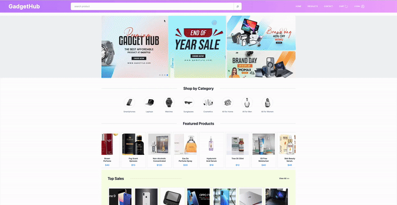

# Gadget Hub

GadgetHub is a comprehensive e-commerce platform catering to the needs of accessory, gadget, and various goods enthusiasts. This full-stack project is built using Next.js, React with TypeScript, Redux, MongoDB, and other cutting-edge technologies.

## Key Features

- **E-commerce Platform**: GadgetHub provides a user-friendly interface for customers to browse and purchase a products.

- **Product Categories**: The platform offers a diverse selection of accessories, gadgets, and other goods, organized into categories for easy navigation

- **User Authentication**: Users can create accounts, log in, and securely manage their profiles, orders, and preferences.

- **Stripe Payment Integration**: GadgetHub securely processes payments using Stripe, enabling users to make purchases with their credit or debit cards.

- **Product Search**: GadgetHub features a search functionality, allowing users to quickly find specific products or browse through relevant categories

- **Shopping Cart**: Customers can add items to their shopping carts, review their selections, and proceed to checkout for seamless purchasing.

- **Wishlist**: Users have the option to save desired items to their wishlist for future reference or purchase.

- **User Dashboard**: Users have access to a control panel to manage their purchases and wishlists.

- **Responsive Design**: The platform is built with responsiveness in mind, ensuring a seamless experience across devices of all sizes, including desktops, tablets, and smartphones.

## Development Stack

- **Next.js**
- **React**
- **TypeScript**
- **Redux**
- **MongoDB**
- **Mongoose**
- **Stripe**
- **Forms, Forms Validation (Yup, Formik)**
- **SSR/CSR**
- **SWR**
- **REST API Routing**
- **Nodemailer**
- **Resend**
- **React Email**
- **Authorization**
- **NextAuth**
- **Tailwind**
- **CSS**
- **Deploy with Vercel**

[Open Demo](https://gadget-hub-shop.vercel.app)



## Setup

1. Clone the repo

   ```shell
    git clone https://github.com/nightshiftmaster/gadget-shop
   ```

2. Change directory to the project directory

   ```shell
   cd gadget-shop
   ```

3. Install the dependencies

   ```shell
    npm install
   ```

4. Run the app

   ```shell
   npm run dev
   ```
